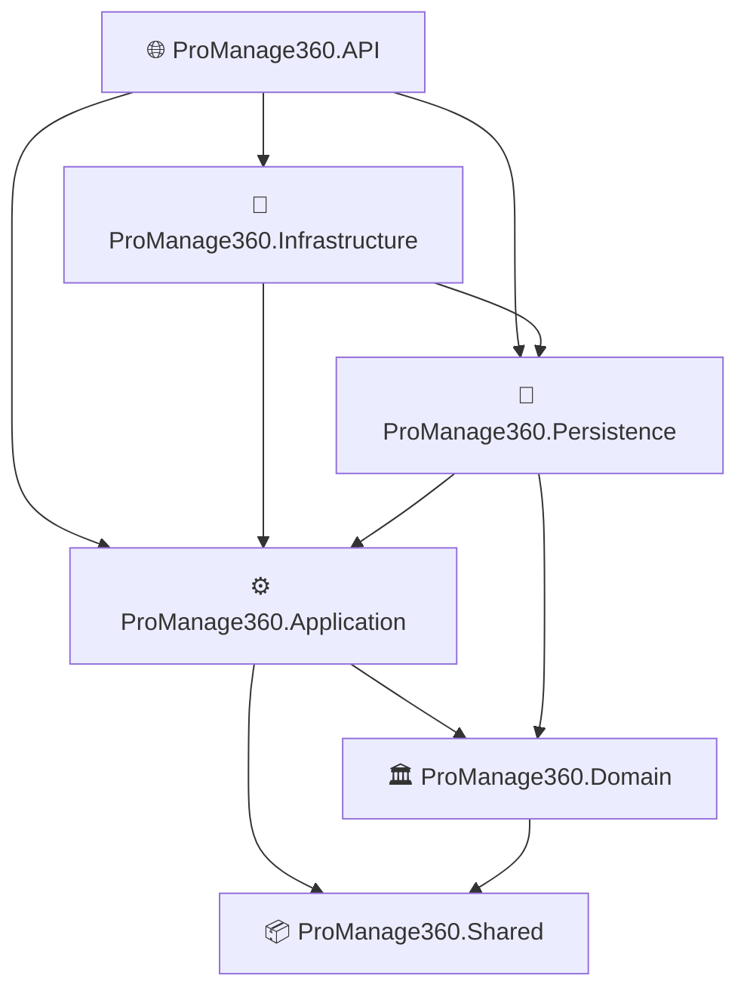
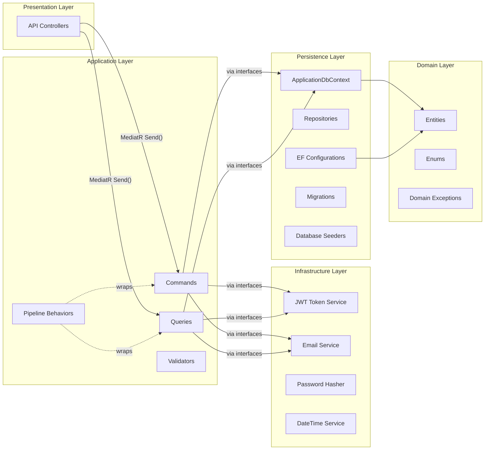
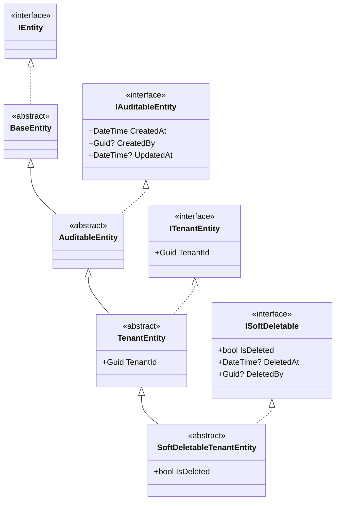
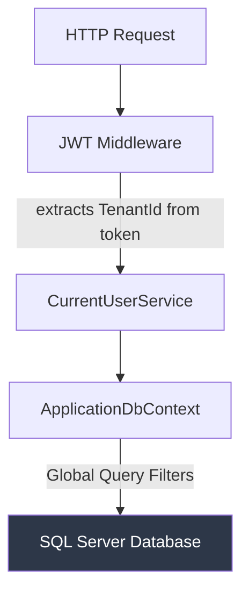
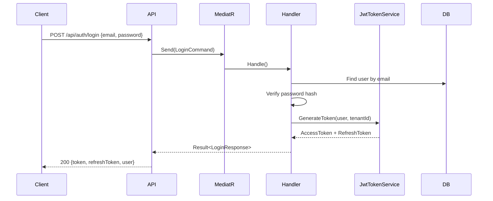
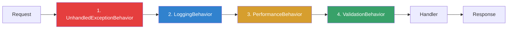
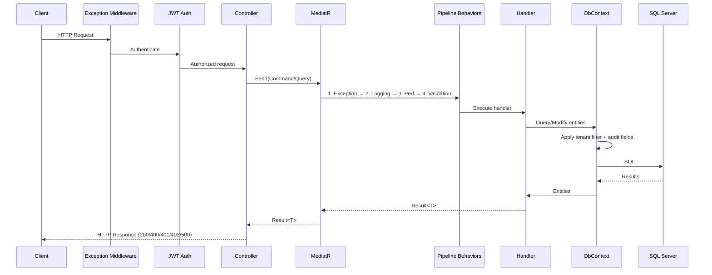

# ProManage360 — High-Level Architecture

> **Multi-tenant SaaS project management platform** built with ASP.NET Core, Clean Architecture, and CQRS.

---

## 1. Solution Structure (6 Projects)

```
ProManage360.sln
└── src/
    ├── ProManage360.Domain            ← Entities, Enums, Interfaces (innermost)
    ├── ProManage360.Application       ← CQRS features, DTOs, Behaviors, Mappings
    ├── ProManage360.Infrastructure    ← JWT, Email, Identity, DateTime services
    ├── ProManage360.Persistence       ← EF Core DbContext, Configs, Migrations, Repos
    ├── ProManage360.API               ← Controllers, Middleware, Program.cs (outermost)
    └── ProManage360.Shared            ← Cross-cutting utilities (currently minimal)
```

### Dependency Graph



> [!IMPORTANT]
> **Domain has zero outward dependencies** (except Shared). Application depends only on Domain. Infrastructure and Persistence implement interfaces defined in Application — this is the Dependency Inversion Principle at work.

---

## 2. Architectural Pattern: Clean Architecture + CQRS



---

## 3. Domain Model

### Entity Hierarchy



### Core Entities

| Entity | Inherits From | Tenant-Scoped | Soft Delete | Description |
|--------|---------------|:---:|:---:|-------------|
| **Tenant** | `AuditableEntity` | ❌ | ❌ | Organization/company with subscription |
| **SuperAdmin** | `BaseEntity` | ❌ | ❌ | Platform-wide administrator |
| **User** | `SoftDeletableTenantEntity` | ✅ | ✅ | User account within a tenant |
| **Role** | `TenantEntity` | ✅ | ❌ | Role within a tenant |
| **UserRole** | `BaseEntity` | ❌ | ❌ | User ↔ Role mapping |
| **Permission** | `BaseEntity` | ❌ | ❌ | System-wide permissions (seeded) |
| **Project** | `SoftDeletableTenantEntity` | ✅ | ✅ | Project within a tenant |
| **TeamMember** | `BaseEntity` | ❌ | ❌ | Project ↔ User membership |
| **TaskItem** | `SoftDeletableTenantEntity` | ✅ | ✅ | Task/issue within a project |
| **TaskComment** | `BaseEntity` | ❌ | ❌ | Comment on a task |
| **TaskAttachment** | `BaseEntity` | ❌ | ❌ | File attachment on a task |
| **TaskLabel** | `TenantEntity` | ✅ | ❌ | Label/tag for tasks |
| **TaskLabelMapping** | `BaseEntity` | ❌ | ❌ | Task ↔ Label many-to-many |
| **Notification** | `TenantEntity` | ✅ | ❌ | User notification |
| **NotificationSetting** | `BaseEntity` | ❌ | ❌ | User notification preferences |
| **ActivityLog** | `TenantEntity` | ✅ | ❌ | Audit trail |
| **RefreshToken** | `BaseEntity` | ❌ | ❌ | JWT refresh token |

### Domain Enums

- `SubscriptionTier` / `SubscriptionStatus` — Tenant subscription management
- `ProjectStatus` / `Priority` — Project lifecycle
- `TaskStatus` / `TaskType` / `TaskPriority` — Task management
- `NotificationType` / `NotificationPriority` — Notification system
- `ActivityActions` — Audit log action types

---

## 4. Multi-Tenancy Strategy



| Aspect | Implementation |
|--------|---------------|
| **Database strategy** | **Shared database** — all tenants in the same database |
| **Isolation mechanism** | EF Core **Global Query Filters** automatically filter by `TenantId` |
| **TenantId injection** | `SaveChangesAsync()` auto-assigns `TenantId` on new `ITenantEntity` records |
| **Current tenant** | Resolved from JWT claims via `ICurrentUserService` |

**Filtered entities**: User, Role, Project, TaskItem, Notification, ActivityLog, TaskLabel

> [!NOTE]
> SuperAdmin and Tenant entities are **not** tenant-filtered — SuperAdmin is platform-wide, and Tenant is the tenant itself.

---

## 5. Authentication & Authorization



| Component | Details |
|-----------|---------|
| **Scheme** | JWT Bearer tokens |
| **Token contents** | UserId, TenantId, Email, Role claims |
| **Refresh tokens** | Stored in DB (`RefreshToken` entity), rotated on use |
| **Password hashing** | Custom `IPasswordHasher` implementation |
| **SuperAdmin auth** | Separate login endpoint (`/SuperAdmin-Login`) |
| **Setup endpoint** | Protected by a static setup secret for initial bootstrapping |

---

## 6. CQRS Feature Organization

Features are organized by **domain area** → **Commands/Queries** → **feature folder**:

```
Features/
├── Auth/
│   ├── Command/
│   │   ├── Login/          → LoginCommand + Handler
│   │   └── RefreshToken/   → RefreshTokenCommand + Handler
│   └── DTOs/               → LoginResponse, RefreshTokenResponse
├── SuperAdmin/
│   ├── Commands/
│   │   ├── ApproveTenant/  → ApproveTenantCommand + Handler + Validator
│   │   └── Login/          → SuperAdminLoginCommand + Handler
│   └── Queries/
│       └── GetPendingTenants/ → GetPendingTenantsQuery + Handler
└── Tenant/
    └── Commands/           → (tenant self-service commands)
```

**Each feature folder** typically contains:
- `XxxCommand.cs` / `XxxQuery.cs` — MediatR request (implements `IRequest<Result<T>>`)
- `XxxHandler.cs` — MediatR handler
- `XxxValidator.cs` — FluentValidation rules (optional)

---

## 7. Cross-Cutting Concerns

### MediatR Pipeline Behaviors (executed in order)



| Behavior | Purpose |
|----------|---------|
| **UnhandledExceptionBehavior** | Outermost catch-all, logs and re-throws |
| **LoggingBehavior** | Logs request name, user, start/end |
| **PerformanceBehavior** | Tracks execution time, warns on slow requests |
| **ValidationBehavior** | Runs FluentValidation validators before handler |

### Global Exception Middleware

Maps domain/application exceptions to RFC 7231-compliant HTTP responses:

| Exception | HTTP Status |
|-----------|-------------|
| `ValidationException` | 400 Bad Request |
| `NotFoundException` | 404 Not Found |
| `ForbiddenAccessException` | 403 Forbidden |
| `ConflictException` | 409 Conflict |
| `TenantLimitExceededException` | 403 Forbidden |
| `BusinessRuleValidationException` | 400 Bad Request |
| Unhandled | 500 Internal Server Error |

### Result Pattern

Operations return `Result` or `Result<T>` instead of throwing exceptions for **expected failures**:
- `Result.Success()` / `Result<T>.Success(data)`
- `Result.Failure("error")` / `Result<T>.Failure("error")`
- Includes pagination support via `PaginatedList<T>`

---

## 8. Infrastructure Services

| Interface (Application) | Implementation (Infrastructure) | Purpose |
|--------------------------|----------------------------------|---------|
| `ICurrentUserService` | `CurrentUserService` | Extracts UserId, TenantId, Email from JWT claims |
| `IJwtTokenService` | `JwtTokenService` | Generates/validates JWT access tokens |
| `IPasswordHasher` | `PasswordHasher` | Hashes and verifies passwords |
| `IEmailService` | `EmailService` | Sends emails (SMTP) |
| `IDateTime` | `DateTimeService` | Abstracts `DateTime.UtcNow` for testability |
| `IApplicationDbContext` | `ApplicationDbContext` | EF Core database context |
| `IUserRepository` | `UserRepository` | User data access |
| `IRoleRepository` | `RoleRepository` | Role data access |
| `IUserRoleRepository` | `UserRoleRepository` | User-role mapping data access |

---

## 9. Database & Persistence

| Aspect | Details |
|--------|---------|
| **ORM** | Entity Framework Core |
| **Database** | SQL Server (LocalDB for dev) |
| **Connection** | `Server=(localdb)\MSSQLLocalDB;Database=ProManage360` |
| **Migrations** | Code-first, assembly in Persistence |
| **Retry policy** | 3 automatic retries on transient failures |
| **Seeded data** | 17 system permissions (Projects, Tasks, Users, Admin, Reports) |
| **Audit tracking** | Automatic via `SaveChangesAsync` override — sets `CreatedAt`, `CreatedBy`, `UpdatedAt` |
| **Soft delete** | Automatic via `SaveChangesAsync` — intercepts `Delete` → sets `IsDeleted`, `DeletedAt`, `DeletedBy` |

---

## 10. API Endpoints (Current)

| Controller | Route | Endpoints |
|------------|-------|-----------|
| **AuthenticationController** | `api/auth` | `POST login`, `POST refresh`, `POST logout` |
| **SuperAdminController** | `api/Admin` | `POST /SuperAdmin-Login`, `GET tenants/pending`, `POST tenants/{id}/approve` |
| **PublicController** | *(public routes)* | Tenant registration / public-facing endpoints |
| **SetupController** | *(setup routes)* | Initial platform bootstrapping (secret-protected) |

---

## 11. End-to-End Request Flow


